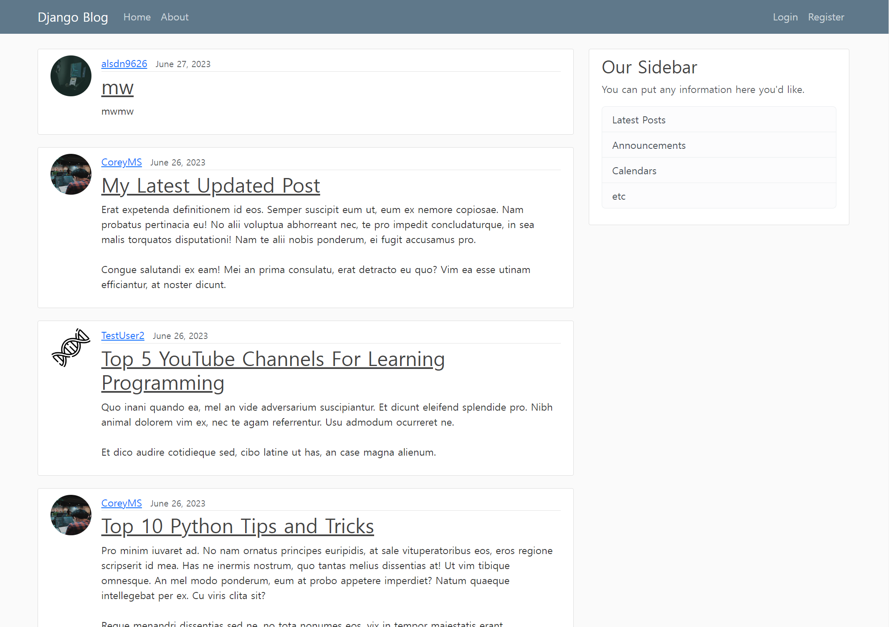

# Django_Blog
## Blog website made with Django



## Key Features
1. Template Inheritance
2. Customized User Model
    1. User Registration
    2. User Login / Logout
    3. User Profile and Picture
3. Create, Update, Delete Post
4. Post Pagination
5. Email and Password Reset

## Run
Within `django_project` directory:
```python
python manage.py runserver
```

## Reference
[Corey MS - Django Tutorials](https://www.youtube.com/playlist?list=PL-osiE80TeTtoQCKZ03TU5fNfx2UY6U4p)

